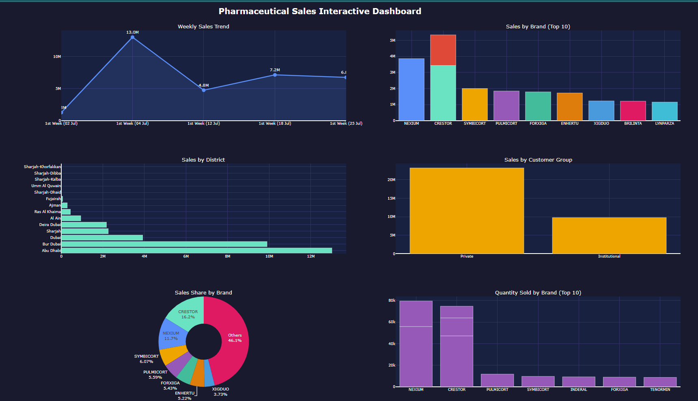

# 📊 Pharmaceutical Sales Interactive Dashboard
Pharmaceutical Sales Interactive Dashboard built with Python, Pandas, and Plotly. 
This project analyzes sales data across brands, districts, and customer segments 
in the UAE market. The dashboard includes weekly sales trends, top brand performance, 
regional distribution, and quantity analysis — designed to support data-driven 
decision making in pharmaceutical sales.

## 📸 Dashboard Preview

## 📌 Introduction
This project presents an interactive sales dashboard built with Python, 
analyzing pharmaceutical sales data from the UAE market (July 2022). 
The goal is to uncover meaningful insights from raw sales data through 
cleaning, analysis, and visualization.

## 🎯 Project Focus
- **Real-World Application:** Analyzing actual pharmaceutical sales data
- **Data-Driven Decision Making:** Extracting insights from sales patterns
- **Interactive Visualization:** Dynamic charts for better understanding

## 🛠️ Tools Used
- **Python** — Core programming language
- **Pandas** — Data cleaning and manipulation
- **Plotly** — Interactive dashboard creation
- **Google Colab** — Development environment

## ❓ Central Question
Is there a significant variation in pharmaceutical sales performance 
across different brands, districts, and customer segments in the UAE market?

## 📂 Dataset
- **Source:** Internal pharmaceutical sales records
- **Period:** July 2022
- **Records:** 4,896 rows, 17 columns
- **Key columns:** Brand, Sales District, Sales Office, Customer Group, 
  SalesValue, SalesQty, Material Group

## 📊 Dashboard Features

| Chart | Description |
|-------|-------------|
| Weekly Sales Trend | Sales performance across 4 weeks of July 2022 |
| Sales by Brand (Top 10) | Highest revenue generating brands |
| Sales by District | Regional sales distribution across UAE |
| Sales by Customer Group | Private vs Institutional sales comparison |
| Sales Share by Brand | Proportional sales contribution (Donut chart) |
| Quantity Sold by Brand | Top 10 brands by units sold |

## 🔍 Methodology

### 1. Data Collection & Preparation
- Loaded raw CSV sales data
- Cleaned column names and removed whitespace
- Parsed date columns and extracted week numbers
- Converted SalesValue and SalesQty to numeric format
- Handled missing values

### 2. Exploratory Data Analysis
- Explored dataset structure and summary statistics
- Identified top performing brands and districts
- Analyzed customer segment distribution

### 3. Data Visualization
- Built 6-panel interactive dashboard using Plotly
- Applied dark theme for professional presentation
- Added hover tooltips for detailed data exploration

## 📈 Key Findings
- **Top Brand:** NEXIUM 40MG leads in both sales value and quantity
- **Top District:** Abu Dhabi records highest sales volume
- **Customer Segment:** Private sector dominates over Institutional
- **Weekly Trend:** Sales show variation across the 4 weeks of July 2022

## 🚀 Live Demo
[View Interactive Dashboard](https://shuraia28.github.io/Pharma_sales_Analysis/sales_dashboard.html)

## 💡 Conclusion
This analysis provides a clear picture of pharmaceutical sales distribution 
across the UAE market. The interactive dashboard enables quick identification 
of top performing brands, districts, and customer segments — supporting 
data-driven decisions in sales strategy.
